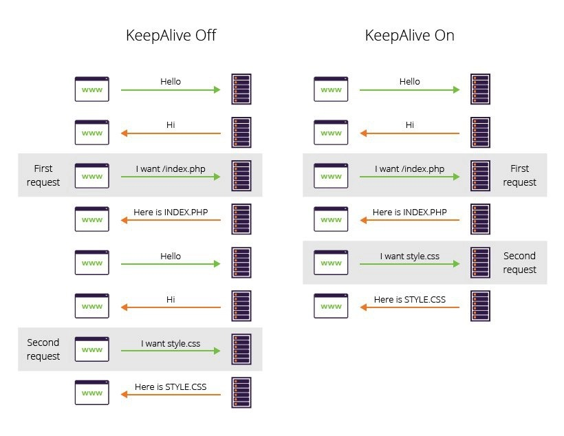

# HTTP Keep Alive Vs TCP keep Alive

#### HTTP Keep-Alive

* HTTP Keep-Alive is a feature that allows HTTP client (usually browser) and server (web server) to send multiple request/response pairs over the same TCP connection.&#x20;
* Since We Use Same TCP Connection , Connection Is already established i.e. No 3 Way Handshake Again .&#x20;
* This decreases latency for 2nd, 3rd,... HTTP request, decreases network traffic and similar.
* The HTTP server doesn't close the TCP connection after each response but waits some time if some other HTTP request will come over it too. After some timeout it closes it anyway.
* If no HTTP request is received by the time of the configured keep-alive time (seconds) the **Web Server** closes the connection. No further HTTP request will be possible after the 'close' done by **Web Server**. (Timeout Is Managed By Server i.e. **Application Layer Control**)

#### TCP KeepAlive

* TCP keepalive is a totally different beast. It keeps TCP connection opened by sending small packets. Additionally, when the packet is sent this serves as a check so the sender is notified as soon as connection drops (note that this is NOT the case otherwise - until we try to communicate through TCP connection we have no idea if it is ok or not).
* TCP Keep-Alive is managed by OS in the TCP layer.
* TCP keep-alive is a periodic check to make sure that the connection is still up and functioning. It's often used to assure that a NAT box (e.g., a DSL router) doesn't "forget" the mapping between an internal and external ip/port.
* This packet is often referred to as a "Keep-Alive" packet, but within the TCP specification it is just a regular `ACK` packet. Applications like Wireshark are able to label it as a "Keep-Alive" packet by meta-analysis of the sequence and acknowledgement numbers it contains in reference to the preceding communications on the socket.



## &#x20;TCP Keep-Alive

### Introduction

TCP connections consist of two sockets, one on each end of the connection. When one side wants to terminate the connection, it sends an `RST` packet which the other side acknowledges and both close their sockets.

Until that happens, however, both sides will keep their socket open indefinitely. This leaves open the possibility that one side may close their socket, either intentionally or due to some error, without informing the other end via `RST`. In order to detect this scenario and close stale connections the TCP Keep Alive process is used.

### Keep-Alive Process

There are three configurable properties that determine how Keep-Alives work. On Linux they are1:

* `tcp_keepalive_time`
  * default 7200 seconds
* `tcp_keepalive_probes`
  * default 9
* `tcp_keepalive_intvl`
  * default 75 seconds

The process works like this:

1. Client opens TCP connection
2. If the connection is silent for `tcp_keepalive_time` seconds, send a single empty `ACK` packet.1
3. Did the server respond with a corresponding `ACK` of its own?
   * **No**
     1. Wait `tcp_keepalive_intvl` seconds, then send another `ACK`
     2. Repeat until the number of `ACK` probes that have been sent equals `tcp_keepalive_probes`.
     3. If no response has been received at this point, send a `RST` and terminate the connection.
   * **Yes**: Return to step 2

This process is enabled by default on most operating systems, and thus dead TCP connections are regularly pruned once the other end has been unresponsive for 2 hours 11 minutes (7200 seconds + 75 \* 9 seconds).

### Gotchas

### 2 Hour Default(7200 Seconds)

Since the process doesn't start until a connection has been idle for two hours by default, stale TCP connections can linger for a very long time before being pruned. This can be especially harmful for expensive connections such as database connections.

### Keep-Alive is Optional

According to [RFC 1122 4.2.3.6](http://www.freesoft.org/CIE/RFC/1122/114.htm), responding to and/or relaying TCP Keep-Alive packets _is optional_:

> Implementors MAY include "keep-alives" in their TCP implementations, although this practice is not universally accepted. If keep-alives are included, the application MUST be able to turn them on or off for each TCP connection, and they MUST default to off.

> It is extremely important to remember that ACK segments that contain no data are not reliably transmitted by TCP.

The reasoning being that Keep-Alive packets contain no data and are not strictly necessary and risk clogging up the tubes of the interwebs if overused.

_In practice however_, my experience has been that this concern has dwindled over time as bandwidth has become cheaper; and thus Keep-Alive packets are not usually dropped. [Amazon EC2 documentation](http://docs.aws.amazon.com/redshift/latest/mgmt/configure-jdbc-options.html) for instance gives an indirect endorsement of Keep-Alive, so if you're hosting with AWS you are likely safe relying on Keep-Alive, but your mileage may vary.

### Changing TCP Timeouts

### Per Socket

Unfortunately since TCP connections are managed on the OS level, Java does not support configuring timeouts on a per-socket level such as in `java.net.Socket`. I have found some attempts3 to use Java Native Interface (JNI) to create Java sockets that call native code to configure these options, but none appear to have widespread community adoption or support.

Instead, you may be forced to apply your configuration to the operating system as a whole. Be aware that this configuration will affect all TCP connections running on the entire system.

### Linux

The currently configured TCP Keep-Alive settings can be found in

* `/proc/sys/net/ipv4/tcp_keepalive_time`
* `/proc/sys/net/ipv4/tcp_keepalive_probes`
* `/proc/sys/net/ipv4/tcp_keepalive_intvl`

You can update any of these like so:

```java
# Send first Keep-Alive packet when a TCP socket has been idle for 3 minutes
$ echo 180 > /proc/sys/net/ipv4/tcp_keepalive_time
# Send three Keep-Alive probes...
$ echo 3 > /proc/sys/net/ipv4/tcp_keepalive_probes
# ... spaced 10 seconds apart.
$ echo 10 > /proc/sys/net/ipv4/tcp_keepalive_intvl
```

Such changes will not persist through a restart. To make persistent changes, use `sysctl`:

```java
sysctl -w net.ipv4.tcp_keepalive_time=180 net.ipv4.tcp_keepalive_probes=3 net.ipv4.tcp_keepalive_intvl=10
```

### Mac OS X

The currently configured settings can be viewed with `sysctl`:

```java
$ sysctl net.inet.tcp | grep -E "keepidle|keepintvl|keepcnt"
net.inet.tcp.keepidle: 7200000
net.inet.tcp.keepintvl: 75000
net.inet.tcp.keepcnt: 8
```

Of note, Mac OS X defines `keepidle` and `keepintvl` in units of milliseconds as opposed to Linux which uses seconds.

The properties can be set with `sysctl` which will persist these settings across reboots:

```java
sysctl -w net.inet.tcp.keepidle=180000 net.inet.tcp.keepcnt=3 net.inet.tcp.keepintvl=10000
```

Alternatively, you can add them to `/etc/sysctl.conf` (creating the file if it doesn't exist).

```java
$ cat /etc/sysctl.conf
net.inet.tcp.keepidle=180000
net.inet.tcp.keepintvl=10000
net.inet.tcp.keepcnt=3
```

### Windows

I don't have a Windows machine to confirm, but you should find the respective TCP Keep-Alive settings in the registry at

`\HKEY_LOCAL_MACHINE\System\CurrentControlSet\Services\TCPIP\Parameters`
