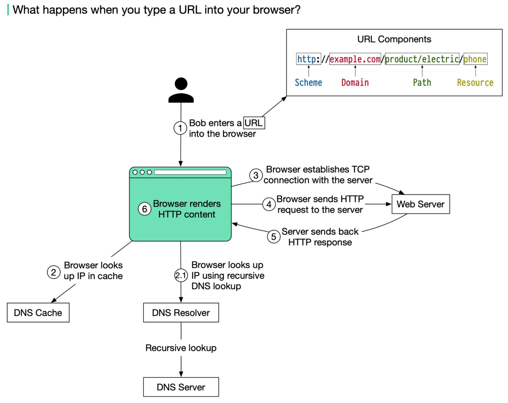

# What happens when you type a URL into your browser?

### **Action**

Bob enters a URL into the browser and hits Enter. In this example, the URL is composed of 4 parts:       **𝒉𝒕𝒕𝒑://𝒆𝒙𝒂𝒎𝒑𝒍𝒆.𝒄𝒐𝒎/𝒑𝒓𝒐𝒅𝒖𝒄𝒕/𝒆𝒍𝒆𝒄𝒕𝒓𝒊𝒄/𝒑𝒉𝒐𝒏𝒆**

&#x20;           🔹 scheme - 𝒉𝒕𝒕𝒑://. This tells the browser to send a connection to the server using HTTPS.&#x20;

&#x20;           🔹 domain - 𝒆𝒙𝒂𝒎𝒑𝒍𝒆.𝒄𝒐𝒎. This is the domain name of the site.

&#x20;           🔹 path - 𝒑𝒓𝒐𝒅𝒖𝒄𝒕/𝒆𝒍𝒆𝒄𝒕𝒓𝒊𝒄. It is the path on the server to the requested resource: phone.&#x20;

&#x20;           🔹 resource - 𝒑𝒉𝒐𝒏𝒆. It is the name of the resource Bob wants to visit.

### DNS LOOKUP  

First, the URL, or domain name, must be converted into an IP address that the browser can use to send an HTTP request. Each domain name is associated with an IP address.

The browser looks up the IP address for the domain with a domain name system (DNS) lookup. To make the lookup process fast, data is cached at different layers: browser cache, OS cache, local network cache, and ISP cache.

&#x20;If the IP address cannot be found at any of the caches, the browser goes to DNS servers to do a **recursive DNS lookup** until the IP address is found .

### HTTP REQUEST 

Now that we have the IP address of the server, the browser establishes a TCP connection with the server.

The browser sends an HTTP request to the server. The request looks like this:

&#x20; `𝘎𝘌𝘛 /𝘱𝘩𝘰𝘯𝘦 𝘏𝘛𝘛𝘗/1.1 𝘏𝘰𝘴𝘵: 𝘦𝘹𝘢𝘮𝘱𝘭𝘦.𝘤𝘰𝘮`

The HTTP request must go through many networking layers (for example SSL if it’s encrypted). These layers generally serve to protect the integrity of the data and do error correction.&#x20;

_For example, the TCP layer handles reliability of the data and orderedness. If packets underneath the TCP layer are corrupted (detected via checksum), the protocol dictates that the request must be resent. If packets arrive in the wrong order, it will reorder them._

But basically, in the end, the server will receive a request from the client at the URL specified, along with metadata in the headers and cookies.

### SERVER HANDLER 

Now the request has been received by some server. Popular server engines are nginx and Apache. What these servers do is handle it accordingly. If the website is static, for example, the server can server a file from the local file system. More often, though, the request is forwarded to an application running on a web framework such as Django or Ruby on Rails.

What these applications do is eventually return a response to the request, but sometimes it may have to perform some logic to serve it. For example, if you’re on Facebook, their servers will parse the request, see that you are logged in, and query their databases and get the data for your Facebook Feed.

Fundamentally the server processes the request and sends back the response. For a successful response (the status code is 200). The HTML response might look like this:

`𝘏𝘛𝘛𝘗/1.1 200 𝘖𝘒 𝘋𝘢𝘵𝘦: 𝘚𝘶𝘯, 30 𝘑𝘢𝘯 2022 00:01:01 𝘎𝘔𝘛 𝘚𝘦𝘳𝘷𝘦𝘳: 𝘈𝘱𝘢𝘤𝘩𝘦 𝘊𝘰𝘯𝘵𝘦𝘯𝘵-𝘛𝘺𝘱𝘦: 𝘵𝘦𝘹𝘵/𝘩𝘵𝘮𝘭; 𝘤𝘩𝘢𝘳𝘴𝘦𝘵=𝘶𝘵𝘧-8`

`<!𝘋𝘖𝘊𝘛𝘠𝘗𝘌 𝘩𝘵𝘮𝘭> <𝘩𝘵𝘮𝘭 𝘭𝘢𝘯𝘨="𝘦𝘯"> 𝘏𝘦𝘭𝘭𝘰 𝘸𝘰𝘳𝘭𝘥 </𝘩𝘵𝘮𝘭>`

### RENDERING 

Now your browser should have gotten a response to its request, usually in the form of HTML and CSS. HTML and CSS are markup languages that your browser can interpret to load content and style the page. Rendering and laying out HTML/CSS is a very tricky process, and rendering engines have to be very flexible so that an unclosed tag, for example, doesn’t crash the page.

The request might also ask to load more resources, such as images, stylesheets, or JavaScript. This makes more requests, and JavaScript may also be used to dynamically alter the page and make requests to the backend. For example, the button on this page uses Javascript to show and hide the solution.

More and more, web applications these days simply load a bare page containing a JavaScript bundle, which, once executed, fetches content from APIs. The JavaScript application then manipulates the DOM to add the content it loaded.

